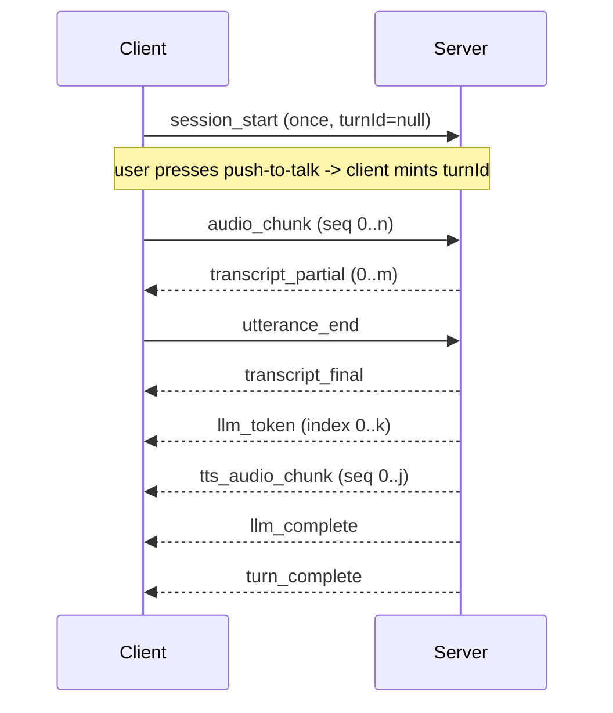

# WebSocket event protocol

This document is the **single source of truth** for the messages exchanged
between the voxwire client and server. Both sides MUST conform to it.

- Transport: a single WebSocket per session at `ws://<host>/ws/session/{sessionId}`.
- Wire format: **JSON text frames**, one JSON object per frame.
- Binary audio is **base64-encoded inside JSON** (not sent as binary frames) so a
  single, uniform message envelope carries every event. This keeps Phase 2
  latency instrumentation simple; revisit binary frames only if base64 overhead
  shows up in the latency budget.

## Common envelope

Every message — in both directions — carries these fields:

| Field | Type | Notes |
|-------|------|-------|
| `type` | string | One of the message types below. |
| `sessionId` | string (UUID) | Stable for the life of the WebSocket connection. |
| `turnId` | string (UUID) \| null | Identifies one request/response turn. `null` only for session-level control messages (e.g. `session_start`). |
| `timestamp` | number | Milliseconds since Unix epoch, set by the **sender** when the frame is emitted. |

Type-specific fields are listed per message. Unknown fields MUST be ignored by
receivers (forward compatibility). Unknown `type` values SHOULD be logged and
otherwise ignored.

### Identifiers

- **`sessionId`**: minted by the client (`crypto.randomUUID()`) and used in the
  connect URL. The server uses the path value as authoritative.
- **`turnId`**: minted by the **client** when a new utterance begins (on the
  first `audio_chunk` of a push-to-talk press). The server echoes the same
  `turnId` on every event it emits for that turn. One utterance = one turn.

### Clock domains

`timestamp` is sender-local wall-clock time. Client and server clocks are **not**
assumed to be synchronized. Phase 2 latency math relies on server-side monotonic
marks (`time.perf_counter()`), not on subtracting client and server wall-clock
timestamps across machines. Client timestamps are used only for relative,
same-origin deltas (e.g. capture duration).

## Audio format decisions

| Direction | Encoding | Sample rate | Channels | Field |
|-----------|----------|-------------|----------|-------|
| Client → Server (`audio_chunk`) | PCM signed 16-bit little-endian (`pcm_s16le`) | 16000 Hz | 1 (mono) | base64 in `data` |
| Server → Client (`tts_audio_chunk`) | PCM signed 16-bit little-endian (`pcm_s16le`) | 24000 Hz | 1 (mono) | base64 in `data` |

Rationale:

- **16 kHz mono PCM upstream** is the lingua franca for streaming ASR (Deepgram,
  Whisper) and avoids server-side transcoding. The browser captures at the device
  rate (typically 48 kHz) and downsamples to 16 kHz via an `AudioWorklet` before
  sending.
- **24 kHz mono PCM downstream** matches common TTS output (e.g. Cartesia) and is
  trivial to queue into the Web Audio API for playback without decoding.
- Each audio message still declares its `encoding` and `sampleRate` explicitly so
  the format can change without breaking the contract.
- **Chunk size:** ~100 ms of audio per `audio_chunk` (balance latency vs. frame
  overhead). For 16 kHz `pcm_s16le` mono that is ~3200 bytes raw (~4.3 KB base64).

---

## Client → Server messages

### `session_start`
Sent once, immediately after the WebSocket opens. Declares the upstream audio
format the client will send. `turnId` is `null`.

```json
{
  "type": "session_start",
  "sessionId": "8f3c...",
  "turnId": null,
  "timestamp": 1718766000000,
  "audio": { "encoding": "pcm_s16le", "sampleRate": 16000, "channels": 1 },
  "client": { "userAgent": "...", "appVersion": "0.1.0" }
}
```

| Field | Type | Notes |
|-------|------|-------|
| `audio` | object | `encoding`, `sampleRate`, `channels` for upstream audio. |
| `client` | object (optional) | Free-form client metadata for logging. |

### `audio_chunk`
A slice of captured microphone audio. Streamed continuously while the user holds
push-to-talk.

```json
{
  "type": "audio_chunk",
  "sessionId": "8f3c...",
  "turnId": "a1b2...",
  "timestamp": 1718766001000,
  "seq": 0,
  "data": "<base64 pcm_s16le>"
}
```

| Field | Type | Notes |
|-------|------|-------|
| `seq` | number | 0-based, monotonically increasing within a turn. Lets the server detect drops/reordering. |
| `data` | string | base64 of raw audio bytes in the format declared by `session_start`. |

### `utterance_end`
Sent when the user releases push-to-talk. Signals the server that no more
`audio_chunk`s are coming for this turn and ASR can finalize.

```json
{
  "type": "utterance_end",
  "sessionId": "8f3c...",
  "turnId": "a1b2...",
  "timestamp": 1718766003000,
  "totalChunks": 30
}
```

| Field | Type | Notes |
|-------|------|-------|
| `totalChunks` | number (optional) | Count of `audio_chunk`s the client sent this turn, for integrity checks. |

---

## Server → Client messages

All server events for a turn carry the `turnId` the client minted.

### `transcript_partial`
Interim ASR hypothesis; may be revised. Zero or more per turn.

```json
{
  "type": "transcript_partial",
  "sessionId": "8f3c...",
  "turnId": "a1b2...",
  "timestamp": 1718766003100,
  "text": "what's the weather"
}
```

### `transcript_final`
The finalized transcript sent to the LLM. Exactly one per successful turn.

```json
{
  "type": "transcript_final",
  "sessionId": "8f3c...",
  "turnId": "a1b2...",
  "timestamp": 1718766003400,
  "text": "what's the weather today?"
}
```

### `llm_token`
One streamed token/delta of the assistant reply. Many per turn.

```json
{
  "type": "llm_token",
  "sessionId": "8f3c...",
  "turnId": "a1b2...",
  "timestamp": 1718766003800,
  "index": 0,
  "text": "It"
}
```

| Field | Type | Notes |
|-------|------|-------|
| `index` | number | 0-based token order within the turn. |
| `text` | string | Token/delta text. Concatenating all `text` in `index` order yields the full reply. |

### `llm_complete`
The full assistant reply text. One per successful turn. Useful for TTS batch
fallback and logging.

```json
{
  "type": "llm_complete",
  "sessionId": "8f3c...",
  "turnId": "a1b2...",
  "timestamp": 1718766004500,
  "text": "It is sunny and 72 degrees today."
}
```

### `tts_audio_chunk`
A slice of synthesized audio for playback. Many per turn.

```json
{
  "type": "tts_audio_chunk",
  "sessionId": "8f3c...",
  "turnId": "a1b2...",
  "timestamp": 1718766004200,
  "seq": 0,
  "encoding": "pcm_s16le",
  "sampleRate": 24000,
  "data": "<base64 pcm_s16le>"
}
```

| Field | Type | Notes |
|-------|------|-------|
| `seq` | number | 0-based playback order within the turn. |
| `encoding` | string | Downstream audio encoding (default `pcm_s16le`). |
| `sampleRate` | number | Downstream sample rate (default `24000`). |
| `data` | string | base64 of raw audio bytes. |

### `turn_complete`
Marks the end of a turn (success or degraded). Exactly one per turn, always the
last message for that `turnId`. Carries a `meta` summary.

```json
{
  "type": "turn_complete",
  "sessionId": "8f3c...",
  "turnId": "a1b2...",
  "timestamp": 1718766004800,
  "meta": {
    "degraded": false,
    "ttsSkipped": false,
    "transcriptChars": 24,
    "replyChars": 32
  }
}
```

| Field | Type | Notes |
|-------|------|-------|
| `meta` | object | Per-turn summary. Phase 2 adds a `latency_report` (see `docs/latency-budget.md`); Phase 3 sets `degraded`/`ttsSkipped`. |

### `error`
A structured failure. May be emitted at any point in a turn; the server still
sends a `turn_complete` afterward when the turn is abandoned.

```json
{
  "type": "error",
  "sessionId": "8f3c...",
  "turnId": "a1b2...",
  "timestamp": 1718766004000,
  "stage": "asr",
  "code": "TIMEOUT",
  "recoverable": true,
  "message": "ASR provider did not respond within 15s"
}
```

| Field | Type | Notes |
|-------|------|-------|
| `stage` | string | `asr` \| `llm` \| `tts` \| `orchestrator` \| `transport`. |
| `code` | string | Machine-readable code, e.g. `TIMEOUT`, `PROVIDER_DOWN`, `BAD_REQUEST`. |
| `recoverable` | boolean | Whether the client may retry the turn. |
| `message` | string | Human-readable detail for display/logging. |

---

## Control messages (transport health)

Carried over from Phase 0 and retained for liveness checks. `turnId` is `null`.

- **`ping`** (C → S): `{ "type": "ping", "sessionId": "...", "turnId": null, "timestamp": ..., "payload": { ... } }`
- **`pong`** (S → C): echoes `sessionId`, server `timestamp`, and the client `payload`.

---

## Turn lifecycle (happy path)



Ordering guarantees:

- `transcript_final` precedes `llm_token`s.
- `llm_token`s and `tts_audio_chunk`s may interleave (TTS can start before the
  LLM finishes).
- `turn_complete` is always the final message for a `turnId`.
- On failure, an `error` is emitted, followed by `turn_complete`.
