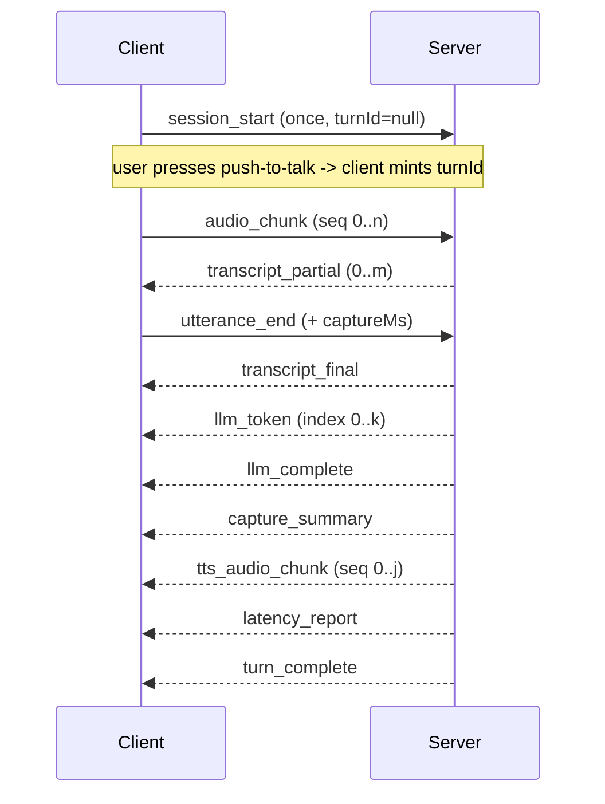

# WebSocket event protocol

This document is the **single source of truth** for the messages exchanged
between the voxwire client and server. Both sides MUST conform to it.

- Transport: a single WebSocket per session at `ws://<host>/ws/session/{sessionId}`.
- Wire format: **JSON text frames**, one JSON object per frame.
- Binary audio is **base64-encoded inside JSON** (not sent as binary frames) so a
  single, uniform message envelope carries every event.

## Common envelope

Every message — in both directions — carries these fields:

| Field | Type | Notes |
|-------|------|-------|
| `type` | string | One of the message types below. |
| `sessionId` | string (UUID) | Stable for the life of the WebSocket connection. |
| `turnId` | string (UUID) \| null | Identifies one request/response turn. `null` only for session-level control messages (e.g. `session_start`, `ping`). |
| `timestamp` | number \| string | Set by the **sender** when the frame is emitted. |

Type-specific fields are listed per message. Unknown fields MUST be ignored by
receivers (forward compatibility). Unknown `type` values SHOULD be logged and
otherwise ignored. The server still replies to unknown client types with a
generic `echo`.

### Identifiers

- **`sessionId`**: minted by the client (`crypto.randomUUID()`) and used in the
  connect URL. The server uses the path value as authoritative.
- **`turnId`**: minted by the **client** when a new utterance begins (on the
  first `audio_chunk` of a push-to-talk press, or when sending `text_turn`).
  The server echoes the same `turnId` on every event it emits for that turn.
  One utterance = one turn.

### Clock domains

Client frames use `Date.now()` (**milliseconds since Unix epoch**). Server
frames use ISO-8601 UTC strings (`datetime.now(timezone.utc).isoformat()`).
Receivers MUST treat `timestamp` as sender-local metadata and MUST NOT subtract
client and server values.

Latency math uses server-side monotonic marks (`time.perf_counter()`), not
wall-clock timestamps. See [`latency-budget.md`](latency-budget.md).

## Audio format decisions

| Direction | Encoding | Sample rate | Channels | Field |
|-----------|----------|-------------|----------|-------|
| Client → Server (`audio_chunk`) | PCM signed 16-bit little-endian (`pcm_s16le`) | 16000 Hz | 1 (mono) | base64 in `data` |
| Server → Client (`tts_audio_chunk`) | PCM signed 16-bit little-endian (`pcm_s16le`) | 24000 Hz | 1 (mono) | base64 in `data` |

Rationale:

- **16 kHz mono PCM upstream** is the lingua franca for streaming ASR (Deepgram)
  and avoids server-side transcoding. The browser captures at the device rate
  (typically 48 kHz) and downsamples to 16 kHz via an `AudioWorklet` before
  sending.
- **24 kHz mono PCM downstream** matches Cartesia output and is trivial to queue
  into the Web Audio API for playback without decoding.
- Each audio message still declares its `encoding` and `sampleRate` explicitly so
  the format can change without breaking the contract.
- **Chunk size:** ~100 ms of audio per `audio_chunk` (balance latency vs. frame
  overhead). For 16 kHz `pcm_s16le` mono that is ~3200 bytes raw (~4.3 KB base64).

---

## Client → Server messages

### `session_start`
Sent once, immediately after the WebSocket opens. Declares the upstream audio
format the client will send. `turnId` is `null`.

```json
{
  "type": "session_start",
  "sessionId": "8f3c...",
  "turnId": null,
  "timestamp": 1718766000000,
  "audio": { "encoding": "pcm_s16le", "sampleRate": 16000, "channels": 1 },
  "client": { "userAgent": "...", "appVersion": "0.1.0" }
}
```

| Field | Type | Notes |
|-------|------|-------|
| `audio` | object | `encoding`, `sampleRate`, `channels` for upstream audio. |
| `client` | object (optional) | Free-form client metadata for logging. |

### `audio_chunk`
A slice of captured microphone audio. Streamed continuously while the user holds
push-to-talk.

```json
{
  "type": "audio_chunk",
  "sessionId": "8f3c...",
  "turnId": "a1b2...",
  "timestamp": 1718766001000,
  "seq": 0,
  "data": "<base64 pcm_s16le>"
}
```

| Field | Type | Notes |
|-------|------|-------|
| `seq` | number | 0-based, monotonically increasing within a turn. Lets the server detect drops/reordering. |
| `data` | string | base64 of raw audio bytes in the format declared by `session_start`. |

### `utterance_end`
Sent when the user releases push-to-talk. Signals the server that no more
`audio_chunk`s are coming for this turn and ASR can finalize.

```json
{
  "type": "utterance_end",
  "sessionId": "8f3c...",
  "turnId": "a1b2...",
  "timestamp": 1718766003000,
  "totalChunks": 30,
  "captureMs": 850
}
```

| Field | Type | Notes |
|-------|------|-------|
| `totalChunks` | number (optional) | Count of `audio_chunk`s the client sent this turn, for integrity checks. |
| `captureMs` | number (optional) | Client-measured push-to-talk hold time (ms). Copied into `latency_report.stages.clientCaptureMs`. |

### `text_turn`
Typed fallback when ASR is unavailable (recoverable ASR error or open ASR
breaker). Skips ASR; the `text` is treated as `transcript_final`.

```json
{
  "type": "text_turn",
  "sessionId": "8f3c...",
  "turnId": "c3d4...",
  "timestamp": 1718766005000,
  "text": "what's the weather today?"
}
```

| Field | Type | Notes |
|-------|------|-------|
| `text` | string | User-typed prompt. Empty text yields `BAD_REQUEST`. |

### `replay_start`
Replay a saved turn from disk (no live microphone). `turnId` may be `null`;
the server mints one for `full` / `mock` if omitted. `recordingPath` must
resolve under `RECORDINGS_DIR`.

```json
{
  "type": "replay_start",
  "sessionId": "8f3c...",
  "turnId": null,
  "timestamp": 1718766006000,
  "recordingPath": "samples/hello-turn.jsonl",
  "mode": "full",
  "mockLlm": false
}
```

| Field | Type | Notes |
|-------|------|-------|
| `recordingPath` | string | JSONL path relative to `RECORDINGS_DIR` (e.g. `samples/hello-turn.jsonl`). |
| `mode` | string | `events` — emit saved frames. `full` — PCM through ASR → LLM → TTS (silent PCM with a transcript skips ASR). `mock` — skip ASR; inject `transcript_final`. Default `events`. |
| `mockLlm` | boolean (optional) | With `mode=mock`, replay recorded LLM/TTS chunks instead of calling providers. |

The same body is accepted by `POST /replay` (JSON); the response is
`{ "metadata", "mode", "events" }`. Path escapes outside `RECORDINGS_DIR` are
rejected with `error` / HTTP 400 (`BAD_REQUEST`, `stage: orchestrator`).

---

## Server → Client messages

All server events for a turn carry the `turnId` the client minted. Server
`timestamp` values are ISO-8601 UTC strings.

### `transcript_partial`
Interim ASR hypothesis; may be revised. Zero or more per turn. Not emitted for
`text_turn`.

```json
{
  "type": "transcript_partial",
  "sessionId": "8f3c...",
  "turnId": "a1b2...",
  "timestamp": "2026-08-16T19:00:03.100000+00:00",
  "text": "what's the weather"
}
```

### `transcript_final`
The finalized transcript sent to the LLM. Exactly one per successful ASR (or
typed) turn; may be empty when ASR fails.

```json
{
  "type": "transcript_final",
  "sessionId": "8f3c...",
  "turnId": "a1b2...",
  "timestamp": "2026-08-16T19:00:03.400000+00:00",
  "text": "what's the weather today?"
}
```

### `llm_token`
One streamed token/delta of the assistant reply. Many per turn.

```json
{
  "type": "llm_token",
  "sessionId": "8f3c...",
  "turnId": "a1b2...",
  "timestamp": "2026-08-16T19:00:03.800000+00:00",
  "index": 0,
  "text": "It"
}
```

| Field | Type | Notes |
|-------|------|-------|
| `index` | number | 0-based token order within the turn. |
| `text` | string | Token/delta text. Concatenating all `text` in `index` order yields the full reply. |

### `llm_complete`
The full assistant reply text. One per turn that reached the LLM (including
timeout fallback copy). Useful for logging; TTS synthesizes this full string.

```json
{
  "type": "llm_complete",
  "sessionId": "8f3c...",
  "turnId": "a1b2...",
  "timestamp": "2026-08-16T19:00:04.500000+00:00",
  "text": "It is sunny and 72 degrees today."
}
```

### `capture_summary`
Integrity snapshot of the inbound capture, emitted after ASR + LLM and before
TTS. Typed turns set `typed: true` and zero audio counters.

```json
{
  "type": "capture_summary",
  "sessionId": "8f3c...",
  "turnId": "a1b2...",
  "timestamp": "2026-08-16T19:00:04.600000+00:00",
  "received": 30,
  "declared": 30,
  "bytes": 96000,
  "clean": true
}
```

| Field | Type | Notes |
|-------|------|-------|
| `received` | number | `audio_chunk`s the server counted. |
| `declared` | number \| null | Client `totalChunks`, if sent. |
| `bytes` | number | Decoded PCM bytes. |
| `clean` | boolean | No seq gaps and `declared` matches `received` (when present). |
| `typed` | boolean (optional) | Present and `true` for `text_turn`. |

### `tts_audio_chunk`
A slice of synthesized audio for playback. Many per turn; omitted when
`ttsSkipped`.

```json
{
  "type": "tts_audio_chunk",
  "sessionId": "8f3c...",
  "turnId": "a1b2...",
  "timestamp": "2026-08-16T19:00:04.200000+00:00",
  "seq": 0,
  "encoding": "pcm_s16le",
  "sampleRate": 24000,
  "data": "<base64 pcm_s16le>"
}
```

| Field | Type | Notes |
|-------|------|-------|
| `seq` | number | 0-based playback order within the turn. |
| `encoding` | string | Downstream audio encoding (default `pcm_s16le`). |
| `sampleRate` | number | Downstream sample rate (default `24000`). |
| `data` | string | base64 of raw audio bytes. |

### `latency_report`
Per-turn latency breakdown. Emitted once per turn, immediately before
`turn_complete`. Also mirrored in `turn_complete.meta.latency_report`. See
`docs/latency-budget.md` for field definitions.

```json
{
  "type": "latency_report",
  "sessionId": "8f3c...",
  "turnId": "a1b2...",
  "timestamp": "2026-08-16T19:00:04.700000+00:00",
  "totalMs": 1200,
  "bottleneckStage": "llm",
  "failedStage": null,
  "stages": {
    "clientCaptureMs": 850,
    "audioUploadMs": 40,
    "asrFirstPartialMs": 180,
    "asrFinalMs": 420,
    "llmTtftMs": 310,
    "llmCompleteMs": 890,
    "ttsTtfbMs": 120,
    "ttsCompleteMs": 280,
    "orchestrationOverheadMs": 45
  },
  "meta": {
    "totalMs": 1200,
    "bottleneckStage": "llm",
    "failedStage": null,
    "degraded": false
  }
}
```

| Field | Type | Notes |
|-------|------|-------|
| `totalMs` | number | Server processing time from `utterance_end` to `turn_complete`. |
| `stages` | object | Per-stage timings (ms). Unrun stages are `null`. |
| `bottleneckStage` | string \| null | Slowest server timeline segment: `asr`, `llm`, `tts`, or `overhead`. |
| `failedStage` | string \| null | First failed stage on degraded turns (`asr`, `llm`, `tts`). |
| `meta` | object | Summary mirror for UI (`totalMs`, `bottleneckStage`, `failedStage`, `degraded`). |

### `turn_complete`
Marks the end of a turn (success or degraded). Exactly one per turn, always the
last message for that `turnId`. Carries a `meta` summary.

```json
{
  "type": "turn_complete",
  "sessionId": "8f3c...",
  "turnId": "a1b2...",
  "timestamp": "2026-08-16T19:00:04.800000+00:00",
  "meta": {
    "degraded": false,
    "degradedMode": null,
    "ttsSkipped": false,
    "ttsChunks": 12,
    "latency": {
      "totalMs": 1200,
      "bottleneckStage": "llm",
      "failedStage": null,
      "degraded": false
    },
    "latency_report": { "...": "full report object" }
  }
}
```

| Field | Type | Notes |
|-------|------|-------|
| `meta.degraded` | boolean | True if any stage emitted `error`. |
| `meta.degradedMode` | string[] \| null | Stages that failed, in order (`asr`, `llm`, `tts`). `null` on a clean turn. |
| `meta.ttsSkipped` | boolean | No `tts_audio_chunk`s were sent. |
| `meta.ttsChunks` | number | Count of `tts_audio_chunk`s. |
| `meta.latency` | object | Summary (`totalMs`, `bottleneckStage`, `failedStage`, `degraded`). |
| `meta.latency_report` | object | Full breakdown; same object as the `latency_report` event body. |

### `error`
A structured failure. May be emitted at any point in a turn; the server still
sends a `turn_complete` afterward.

```json
{
  "type": "error",
  "sessionId": "8f3c...",
  "turnId": "a1b2...",
  "timestamp": "2026-08-16T19:00:04.000000+00:00",
  "stage": "asr",
  "code": "TIMEOUT",
  "recoverable": true,
  "message": "Couldn't hear you — try again or type below."
}
```

| Field | Type | Notes |
|-------|------|-------|
| `stage` | string | `asr` \| `llm` \| `tts` \| `orchestrator`. |
| `code` | string | `TIMEOUT`, `PROVIDER_DOWN`, `STREAM_FAILED`, `CONFIG_ERROR`, `BAD_REQUEST`, `BREAKER_OPEN`. |
| `recoverable` | boolean | Whether another attempt in this session is useful. See the README recoverable table. |
| `message` | string | Human-readable detail for display/logging. |
| `cooldownMs` | number (optional) | Present on `BREAKER_OPEN`. Remaining cooldown; ASR clients should block push-to-talk for this long. |

---

## Control messages (transport health)

Retained for liveness checks. `turnId` is `null`.

**`ping` (C → S)**

```json
{
  "type": "ping",
  "sessionId": "8f3c...",
  "turnId": null,
  "timestamp": 1718766000000,
  "payload": { "sentAt": 1718766000000 }
}
```

**`pong` (S → C)** — echoes the client payload on `echo` (not `payload`):

```json
{
  "type": "pong",
  "sessionId": "8f3c...",
  "timestamp": "2026-08-16T19:00:00.050000+00:00",
  "echo": { "sentAt": 1718766000000 }
}
```

---

## Recordings

Each completed turn is persisted under `RECORDINGS_DIR` (default `recordings/`):

- `{turnId}.jsonl` — first line is `recording_meta`, then every server-emitted
  protocol event for the turn.
- `{turnId}.pcm` — concatenated upstream PCM16, omitted when there was no audio.

`recording_meta` is not sent on the WebSocket. Fields: `sessionId`, `turnId`,
`timestamp`, `audioFile`, `audioEncoding`, `audioSampleRate`, `audioChannels`,
`audioBytes`, `transcriptLength`, `replyLength`, `tokenCount`, `degraded`,
`ttsSkipped`, `ttsChunks`.

Offline playback:

| Mode | Behavior |
|------|----------|
| **events** | Emit the JSONL protocol stream (no providers). Default. |
| **full** | Inject saved PCM through ASR → LLM → TTS. Silent PCM with a `transcript_final` skips ASR and injects that text. |
| **mock** | Skip ASR; inject `transcript_final` into LLM → TTS. |
| **mock** + `mockLlm` | Replay recorded LLM/TTS chunks instead of calling providers. |

Triggers: `replay_start`, `POST /replay`, or `python -m server.replay recordings/samples/hello-turn.jsonl`.

| Source | Typical path | Notes |
|--------|--------------|--------|
| Hello-turn fixture | `samples/hello-turn.jsonl` | PCM is silence; **full** uses saved `hello`. Events TTS is a stub. |
| Degraded fixture | `samples/degraded-llm-config.jsonl` | No PCM. The client disables **full**. **events** replays the saved `CONFIG_ERROR` (expected). |
| Live turn | `{turnId}.jsonl` | Written at recordings root. UI **Replay** on the chat/latency row. |

Checked-in fixtures: `recordings/samples/degraded-llm-config.jsonl` (degraded,
no audio) and `recordings/samples/hello-turn.jsonl` (+ `hello-turn.pcm`).
The client dropdown sends `replay_start` for these paths (or a custom path
under `RECORDINGS_DIR`) and marks the turn as a replay. Finished chat turns
and latency rows expose the live `{turnId}.jsonl` path with copy + Replay.

---

## Turn lifecycle (happy path)


```mermaid
sequenceDiagram
  participant C as Client
  participant S as Server

  C->>S: session_start (once, turnId=null)
  Note over C,S: user presses push-to-talk -> client mints turnId
  C->>S: audio_chunk (seq 0..n)
  S-->>C: transcript_partial (0..m)
  C->>S: utterance_end (+ captureMs)
  S-->>C: transcript_final
  S-->>C: llm_token (index 0..k)
  S-->>C: llm_complete
  S-->>C: capture_summary
  S-->>C: tts_audio_chunk (seq 0..j)
  S-->>C: latency_report
  S-->>C: turn_complete
```

Ordering guarantees:

- `transcript_final` precedes `llm_token`s.
- TTS starts only after `llm_complete` (full-reply synthesis). `llm_token`s and
  `tts_audio_chunk`s do **not** interleave in the current orchestrator.
- `capture_summary` is emitted after LLM and before TTS.
- `latency_report` immediately precedes `turn_complete`.
- `turn_complete` is always the final message for a `turnId`.
- On failure, one or more `error` events are emitted, then the remaining
  lifecycle events, then `turn_complete` with `meta.degraded: true`.
