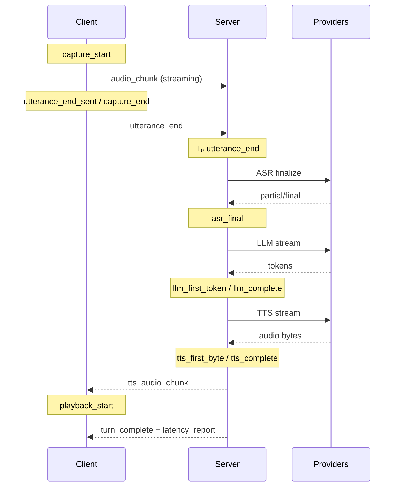

# Latency budget

This document defines **what we measure**, **where we mark it**, and **how it
maps to the `latency_report` event** emitted at the end of each turn (Phase 2,
issues #15–#17). It is the spec implementors follow before adding code in
`server/latency/` and the client UI.

Related: [`event-protocol.md`](event-protocol.md) (wire format),
[`architecture.md`](architecture.md) (component boundaries).

---

## Goals

1. **Decompose** each turn into stage timings (capture → ASR → LLM → TTS → playback).
2. **Measure at our boundaries** — when voxwire sends/receives bytes to/from a
   provider adapter, not inside vendor SDKs.
3. **Use monotonic clocks on the server** — client and server wall clocks are not
   assumed to be synchronized (see [Clock domains](#clock-domains)).
4. **Support felt latency** — the user cares about “release button → hear reply”;
   that requires one client-side mark at playback start.

---

## Anchor: T₀

All **server-side stage fields** in `latency_report.stages` are milliseconds
relative to **T₀**:

| Mark | Where | Clock |
|------|-------|-------|
| **`utterance_end`** | Server receives the `utterance_end` JSON frame for the turn | `time.perf_counter()` |

T₀ is “the user released push-to-talk and the server knows the utterance is
complete.” Everything through `turn_complete` is measured from here.

**Exception:** `clientCaptureMs` is measured entirely on the client (see below).

---

## Wire event: `latency_report`

Emitted once per turn, embedded in `turn_complete.meta.latency_report` (issue
#16). Standalone shape for reference:

```json
{
  "type": "latency_report",
  "sessionId": "...",
  "turnId": "...",
  "timestamp": 1718766004800,
  "totalMs": 1200,
  "stages": {
    "clientCaptureMs": 850,
    "audioUploadMs": 40,
    "asrFirstPartialMs": 180,
    "asrFinalMs": 420,
    "llmTtftMs": 310,
    "llmCompleteMs": 890,
    "ttsTtfbMs": 120,
    "ttsCompleteMs": 280,
    "orchestrationOverheadMs": 45
  }
}
```

| Field | Type | Meaning |
|-------|------|---------|
| `totalMs` | number | `turn_complete` − T₀ (server monotonic, rounded to ms) |
| `stages` | object | Per-stage deltas (see [Stage fields](#stage-fields)) |

If a stage did not run (empty transcript, degraded turn), its field is **`null`**
(not `0`) so the UI can distinguish “skipped” from “instant.”

---

## Stage fields

Each row: **field name**, **definition**, **start mark → end mark**, **clock**.

### `clientCaptureMs` (client only)

| | |
|--|--|
| **What** | How long the user held push-to-talk (capture window). |
| **Start** | `capture_start` — `AudioCapture.start()` resolved (mic live). |
| **End** | `capture_end` — client sends `utterance_end`. |
| **Clock** | Client `Date.now()` (same origin; not compared to server). |
| **Source** | Client sends `{ captureMs }` on `utterance_end` (optional field, issue #15). Server copies into report unchanged. |

This is **not** relative to T₀; it explains how much audio was recorded, not
server processing time.

### `audioUploadMs` (server)

| | |
|--|--|
| **What** | Tail latency after the last audio byte arrives — network + WS framing before the server treats the utterance as closed. |
| **Start** | `last_audio_chunk` — server handles the last in-order `audio_chunk` for the turn (highest `seq` seen before or at `utterance_end`). |
| **End** | T₀ (`utterance_end` received). |
| **Formula** | `audioUploadMs = utterance_end − last_audio_chunk` (≥ 0; clamp if reordering). |

If `utterance_end` arrives before the last chunk (reordering), use the later of
the two marks and set `audioUploadMs` to 0; log a sequence warning (already
tracked in `capture_summary.clean`).

### `asrFirstPartialMs` (server, from T₀)

| | |
|--|--|
| **What** | Time until the first streaming ASR hypothesis is ready to emit. |
| **End** | `asr_first_partial` — orchestrator emits first `transcript_partial` for the turn. |
| **Formula** | `asrFirstPartialMs = asr_first_partial − T₀` |

Zero or more partials may arrive **before** T₀ while the user is still talking;
those are **not** used. Only the first partial **after** T₀ counts (post-release
ASR latency). If a partial was already emitted pre-T₀ and no new partial arrives,
this field is `null`.

### `asrFinalMs` (server, from T₀)

| | |
|--|--|
| **What** | Time until finalized transcript is ready for the LLM. |
| **End** | `asr_final` — `session.finalize()` returned; orchestrator emits `transcript_final`. |
| **Formula** | `asrFinalMs = asr_final − T₀` |

### `llmTtftMs` (server, from T₀)

| | |
|--|--|
| **What** | **Time to first token** — LLM streaming latency perceived by the pipeline. |
| **Start** | `llm_start` — orchestrator calls `LLMProvider.stream()` (after non-empty `transcript_final`). |
| **End** | `llm_first_token` — first non-empty `llm_token` emitted. |
| **Formula** | `llmTtftMs = llm_first_token − T₀` |

Also record `llm_start` internally; optional debug span
`llm_first_token − llm_start` is provider-only TTFT (excludes ASR finalize gap).

### `llmCompleteMs` (server, from T₀)

| | |
|--|--|
| **What** | Time until the full assistant reply text is assembled. |
| **End** | `llm_complete` — orchestrator emits `llm_complete`. |
| **Formula** | `llmCompleteMs = llm_complete − T₀` |

### `ttsTtfbMs` (server, from T₀)

| | |
|--|--|
| **What** | **Time to first byte** of synthesized audio. |
| **Start** | `tts_start` — orchestrator calls `TTSProvider.stream()`. |
| **End** | `tts_first_byte` — first non-empty `tts_audio_chunk` emitted. |
| **Formula** | `ttsTtfbMs = tts_first_byte − T₀` |

TTS may start before `llm_complete` (streaming reply into TTS); this field still
uses T₀ so it reflects user-perceived “release → first audio out of server.”

### `ttsCompleteMs` (server, from T₀)

| | |
|--|--|
| **What** | Time until the last TTS audio chunk is sent for the turn. |
| **End** | `tts_complete` — TTS async iterator exhausted; last `tts_audio_chunk` emitted. |
| **Formula** | `ttsCompleteMs = tts_complete − T₀` |

If TTS is skipped (`ttsSkipped: true`), this field is `null`.

### `orchestrationOverheadMs` (server)

| | |
|--|--|
| **What** | Time spent in voxwire itself (decode, serialize, scheduling, recording) outside provider I/O windows. |
| **Formula** | See [Overhead calculation](#overhead-calculation). |

---

## Overhead calculation

Provider windows (server monotonic, pairwise non-overlapping spans):

```
asrWindow   = asr_final   − T₀
llmWindow   = llm_complete − llm_start
ttsWindow   = tts_complete − tts_start
```

These may **overlap** (TTS while LLM still streaming). Overhead is the residual
after subtracting the **union** of busy intervals from `totalMs`:

```
busyMs = length( union( [T₀, asr_final], [llm_start, llm_complete], [tts_start, tts_complete] ) )
orchestrationOverheadMs = totalMs − busyMs
```

Intuition: gaps between stages (e.g. ASR finalize → LLM start), base64 decode,
JSON emit, `TurnRecorder` I/O, and `capture_summary` all count as overhead.

`orchestrationOverheadMs` is always ≥ 0; clamp at 0 if floating-point / rounding
produces a small negative.

---

## Server marks (complete list)

Recorded by `LatencyTracker` (issue #15) inside `PipelineOrchestrator` unless
noted. Storage: `time.perf_counter()`; convert to ms with `(t − T₀) * 1000`.

| Mark | Trigger |
|------|---------|
| `first_audio_chunk` | First `audio_chunk` received for turn (pre-T₀). |
| `last_audio_chunk` | Latest in-order `audio_chunk` before/at utterance close. |
| **`utterance_end`** | **`utterance_end` frame received → sets T₀.** |
| `asr_first_partial` | First `transcript_partial` emitted **after** T₀. |
| `asr_final` | `transcript_final` emitted. |
| `llm_start` | `LLMProvider.stream()` invoked. |
| `llm_first_token` | First `llm_token` emitted. |
| `llm_complete` | `llm_complete` emitted. |
| `tts_start` | `TTSProvider.stream()` invoked. |
| `tts_first_byte` | First `tts_audio_chunk` emitted. |
| `tts_complete` | TTS stream finished (after last chunk). |
| **`turn_complete`** | **`turn_complete` emitted → sets totalMs end.** |

Optional debug marks (logged, not in `stages` JSON v1):

- `asr_start` — first audio forwarded to ASR for turn (usually ≈ `first_audio_chunk`).
- `error` — stage + timestamp when `error` event emitted (for degraded turns).

---

## Client marks

Recorded in the browser; used for felt latency and `clientCaptureMs`.

| Mark | Trigger | Clock |
|------|---------|-------|
| `capture_start` | `AudioCapture.start()` resolved | `Date.now()` |
| `first_audio_chunk_sent` | First `audio_chunk` sent for turn | `Date.now()` |
| `utterance_end_sent` | `utterance_end` sent | `Date.now()` |
| **`playback_start`** | **`TtsPlayer` schedules first sample of turn** (`onPlaybackStart`) | `Date.now()` |

### Felt latency (client, not in server `stages`)

User-perceived “release → hear reply”:

```
feltLatencyMs = playback_start − utterance_end_sent
```

Issue #17 displays this in the waterfall UI alongside server `latency_report`
fields. The client may send `feltLatencyMs` back in a future `turn_ack` or log
locally only in v1.

`playback_start` is already hooked in `client/src/main.ts` (debug log today;
UI in #17).

---

## Turn timeline (reference)



---

## Delivery

| When | Where |
|------|-------|
| End of every turn | Standalone `latency_report` event, then `turn_complete` |
| Summary mirror | `turn_complete.meta.latency` (key numbers for UI) |
| Full breakdown | `turn_complete.meta.latency_report` (same object as the event) |
| Degraded turns | Same; unset stage fields are `null`; `failedStage` set; `totalMs` still set |

Example `turn_complete` excerpt:

```json
{
  "type": "turn_complete",
  "turnId": "a1b2...",
  "meta": {
    "degraded": false,
    "ttsSkipped": false,
    "ttsChunks": 12,
    "latency_report": {
      "totalMs": 1200,
      "bottleneckStage": "llm",
      "failedStage": null,
      "stages": { "...": "..." },
      "meta": {
        "totalMs": 1200,
        "bottleneckStage": "llm",
        "failedStage": null,
        "degraded": false
      }
    },
    "latency": {
      "totalMs": 1200,
      "bottleneckStage": "llm",
      "failedStage": null,
      "degraded": false
    }
  }
}
```

---

## Implementation notes (issues #15–#17)

| Issue | Work |
|-------|------|
| **#15** | `LatencyTracker` in `server/latency/`; orchestrator calls `mark()` at each row above |
| **#16** | Attach aggregated report to `turn_complete.meta.latency_report` |
| **#17** | Client waterfall + last-N table; render `stages` + `feltLatencyMs` |
| **#16 (degraded)** | On stage error, freeze marks at failure point; remaining stages `null` |

### Rounding

- Store internally as float seconds (`perf_counter` delta).
- Emit integers in JSON: `round(ms)`.
- `totalMs` uses the same T₀ and `turn_complete` marks as stages.

### Testing

- Unit-test `LatencyTracker` mark ordering and overhead union math with synthetic
  timestamps (issue #15).
- Golden JSON fixture for one happy-path turn in `tests/fixtures/latency_report.json`.

---

## Budget targets (informational)

Not enforced in Phase 2; used for UI coloring in #17.

| Stage | Target | Notes |
|-------|--------|-------|
| `asrFinalMs` | < 500 ms | Short utterances |
| `llmTtftMs` | < 400 ms | Gemini Flash class models |
| `ttsTtfbMs` | < 200 ms | Cartesia streaming |
| `feltLatencyMs` | < 1500 ms | End-to-end UX goal |

Adjust per deployment; see Phase 3 timeouts (#19) for enforcement.
